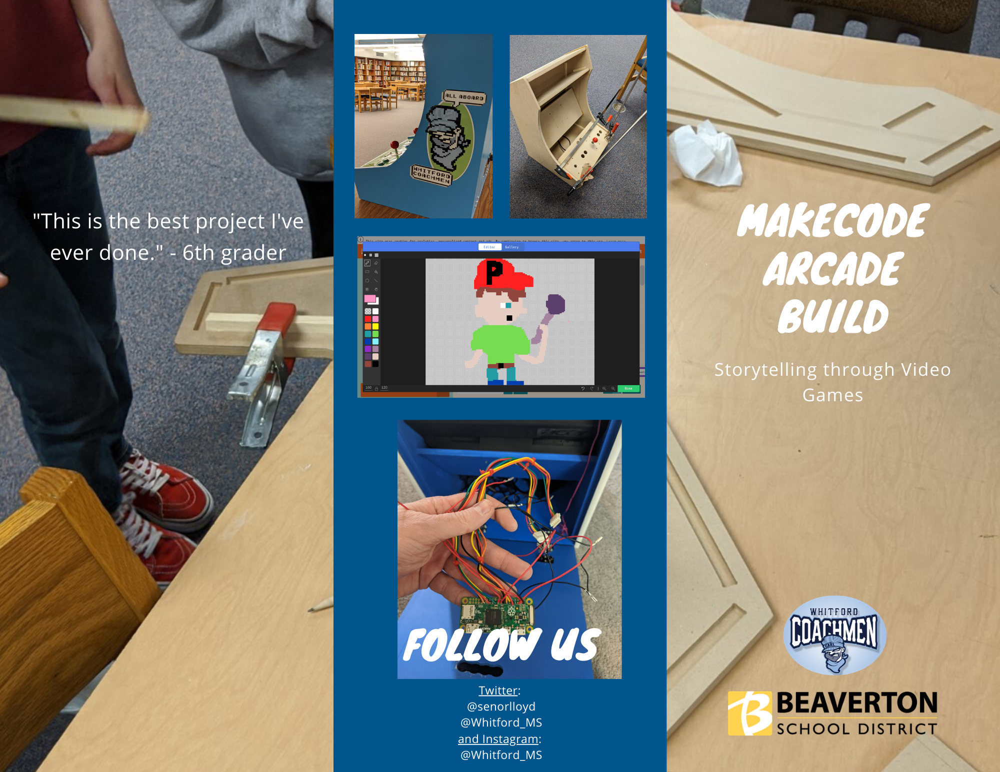
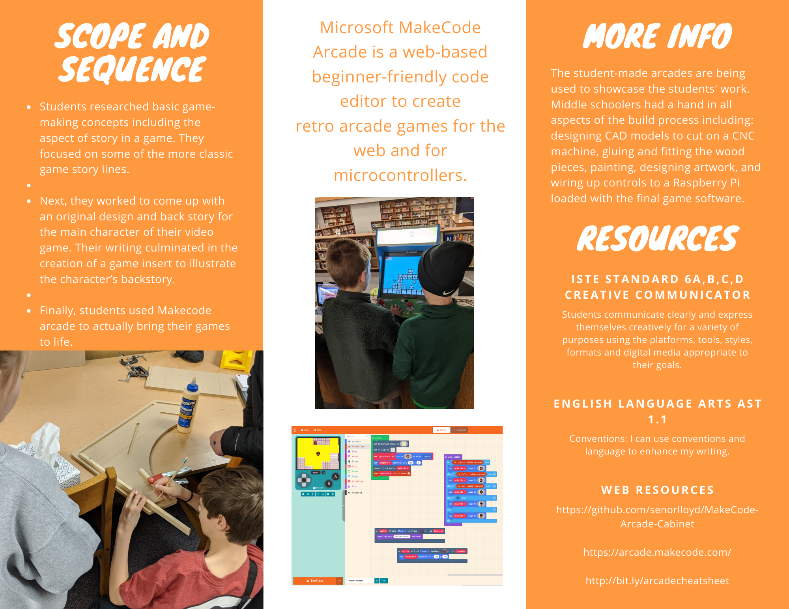

# MakeCode Arcade Cabinet Project

This project was born out of a desire to have an easy way for my students to code games on the Microsoft MakeCode Arcade platform.  Afterwards, to showcase and test their games on an arcade platform, I wanted them to be able to easily transfer those games from their student Chromebooks(or any device with USB) to the arcade. Feel free to grab any of the cad files if you want to create your own.  The design could probably be improved but worked well for us to build 2 arcade cabinets for use in our school.

## Basic Parts List
Acer V196L - LED monitor - 19”
24” x 24” plexiglass for monitor cover and marquee graphics
USB 3.0 Male to USB 3.0 Female AUX Flush Mount cable
Mini HDMI to VGA Adapter with 3.5mm audio
10A 250V AC Rocker Switch 3 Pin
Flexible Waterproof LED Light Strip
Snap in arcade push buttons 30mm
Adafruit Small Arcade Joystick
Raspberry Pi Zero, no need for the wifi version
Aluminum angle bracket .75 x .5” for marquee retainer
90 degree Cabinet Hidden Hinge
Surge Protector
5V charging adapter and cable to run Rpi

## Notes:
I made my own cable to convert USB type A female to micro usb male in order to plug into the Raspberry Pi for uploading games.

Different buttons and joysticks can obviously be used but would necessitate redesigning the control panel.  

Other monitors could be used but the V196L happens to have built-in speakers which is nice and simplifies the build.

I’m too lazy to calculate final cost but I would put it at about $200-250 with about half the cost being the monitor.  Different designs could be made with a cheaper monitor but expect to pay $100+ for a 4:3 19”.

The wood pieces could easily be cut out of 1 full panel of 1/2" 4x8’ MDF.

